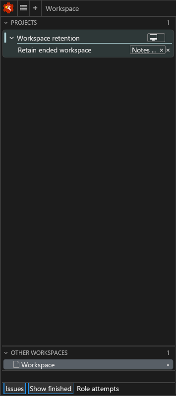

# Retained subject workspaces

A workspace opened from a sidebar subject stays linked to that subject when
it ends. Show finished exposes it with a × marker and Ended workspace hover text. Focusing
it uses its original workspace ID; its panels and tabs are not recreated.
Other workspaces still contains ordinary workspaces without subjects.

Published convoy phases `landed`, `abandoned`, and `cancelled`, superseded
generations, and producer identity retractions are authoritative ends. Fact
expiry, empty drains during disconnects, and subsequent reassertions are
unobserved periods, which preserve the existing path without marking it ended.
A standing role outlives the terminal phase of its current attempt.

Retained paths are held while their workspace remains open. No timeout runs ([policy follow-up #159](https://github.com/flotilla-org/wheelhouse/issues/159)):
`retained_workspace_expired` in Andamento is the policy seam for #159's later
expiry decision. Historical search and log navigation remain outside this slice.



This native Linux sidebar capture was taken under Xvfb with the daily-driver
KDL. The project, convoy and vessel were published through the real HTTP/UDS
ingress. The vessel workspace was opened, then the producer published landed
on its convoy and vessel. With Show finished off, its rows disappeared without
an Other workspaces fallback; with it on, the same workspace reappeared under
its convoy. The unrelated Workspace row remains in Other workspaces.

## Validation

- Native Linux build with clang, Cleat's `none` feature set, and the existing
  workflow-pinned Jackstay succeeds.
- All 26 scenarios in `tools/test-native-sidebar.py` pass against Andamento
  `1527d80` (companion PR andamento#121). They use the real daily-driver
  templates and C ABI, including source-heartbeat removal, alias identity,
  Show finished, focus and user close.
- Andamento's 114 unit tests and 41 sidebar scenarios pass. Disconnect tests
  cross the lease boundary, stay on the original project path, reconnect,
  and remain unended. Tests also cover ancestor removal, repeated authoritative
  ends, no timer, standing roles, unrelated sources and subjectless workspaces.
- Targeted core mutations removing retained catalog augmentation, terminal-phase
  detection, and explicit fact withdrawal each fail the corresponding scenario.
  Native mutations dropping the ended glyph or letting opening override ended
  each fail the shared-renderer diagnostics. The new lifecycle test also
  fails against the unpatched core.

Reproduce the headless ABI acceptance after building:

```sh
python3 tools/test-native-sidebar.py ../andamento/target/x86_64-unknown-linux-gnu/debug/libandamento_ffi.so
```

For a live presentation, use isolated user/project settings with
`--andamento_socket:<private-directory>/facts.sock` and
`--andamento_config:data/sidebar/daily-driver.kdl`. Publish a project, convoy
and vessel with an attach recipe, open the vessel, then publish its terminal
phase or retract its identity facts. Toggle Show finished and focus its row.
The implementation and screenshot do not claim macOS or Windows visual
validation; their existing native CI builds exercise the shared code.
