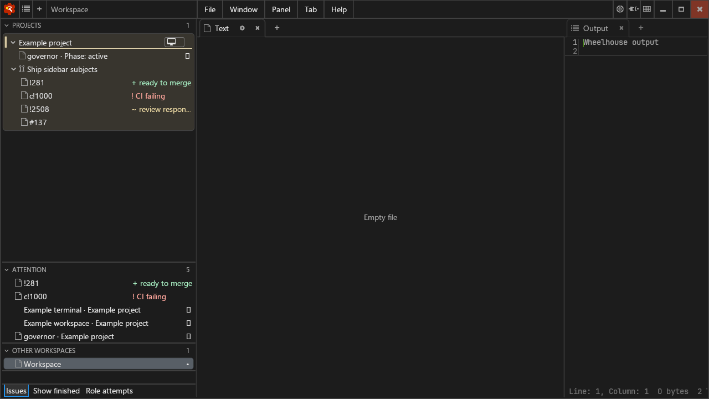
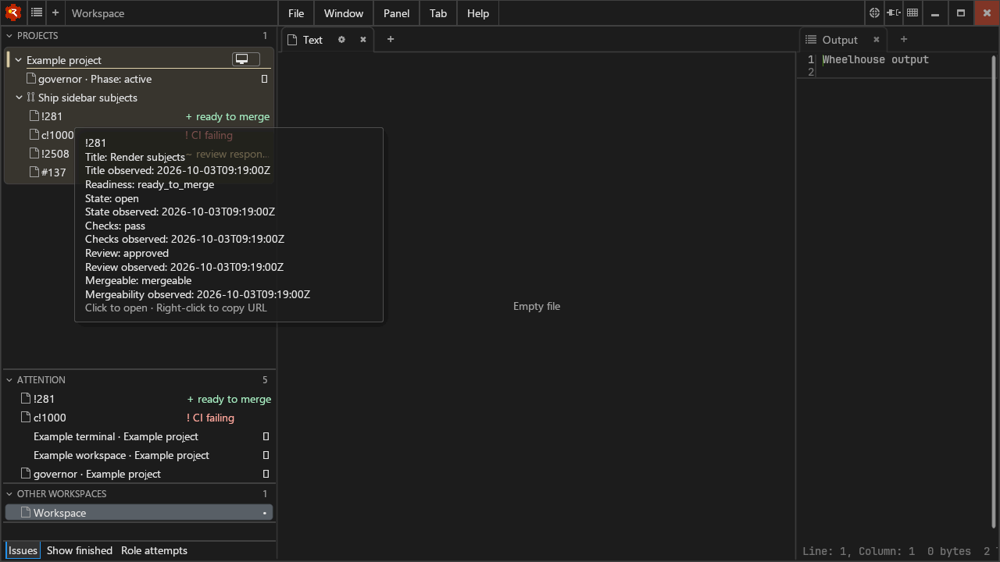
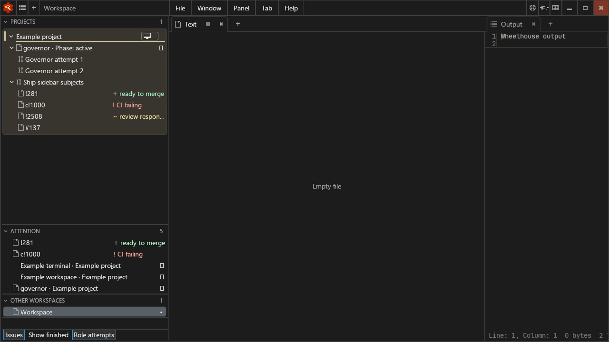

# Sidebar subjects: call for human review

The daily-driver sidebar renders each convoy's own name, then PR and issue
rows joined through typed subject edges. PR rows precede issue rows and sort
numerically within their group. Subjects retain their own producer label tiers.
Readiness supplies the badge; ready-to-merge and CI-failing subjects also appear
in Attention without producer `status.attention` facts. The owner merges.

Standing roles expose their lifted phase, attention and attach action. Role
attempts expands the producer's oldest-first history under that role. Show
finished exposes retained merged/closed subjects and superseded task convoys;
closed issues also require Issues. Flotilla owns the 24-hour retention window.

## Screenshots and human phase

Please review badge colour/readability, hover density, and the role history layout.
A human review was requested during implementation; these screenshots document
the concrete presentation for that review. Automated rendering is not human
acceptance.







Reproduce on a built checkout with isolated settings:

```sh
./build/wheelhouse --sidebar_subject_fixture --user:/tmp/sidebar-review-user --project:/tmp/sidebar-review-project
```

- Check `!281` precedes `c!1000`, followed by the no-forge subject and issue.
- Check ready/CI-failing PRs appear in Attention.
- Click a PR or issue to launch its canonical URL; right-click to copy its URL.
  The fixture forge deliberately uses `/review/` and `/ticket/` to expose any
  hard-coded forge URL shapes. Browser launch uses `xdg-open` on Linux.
- Right-click `!2508` to copy its short reference; there is no URL action.
- Hover subjects for title, state, checks, review, mergeability and freshness.
- Toggle Role attempts to show the two generations once each, oldest first.
  Toggle Show finished to show the superseded task generation sharing the PRs.

## Evidence and limits

`./build.sh wheelhouse` passed with clang, sibling Andamento at `fa8cfd2`,
`WHEELHOUSE_CLEAT_FEATURES=none`, and the workflow-pinned Jackstay checkout.
The 24 native ABI tests and generated-fixture locale/newline test pass.
`tools/test-sidebar-subject-actions.py` exercises real mouse gestures and the
external X11 clipboard; its browser subprocess records the exact destination
without navigating to fixture URLs. Tree and Attention URL copies, no-forge
reference copy, and PR/issue browser dispatch passed under Xvfb/software OpenGL.
Screenshots were captured from that native Linux presentation.

All seven readiness values and finished/Issues transitions are covered through
the real Andamento ABI. The native badges for conflicting, draft, merged, closed,
and orphaned were only built locally; their visual presentation was not exercised.
macOS and Windows were not built or exercised locally. Human visual approval
has not been claimed. The Linux writer now serves small UTF-8/ASCII clipboard
copies; external clipboard reads, PRIMARY integration and large INCR transfers
remain outside this change.

The consumer requires the companion Andamento forward-loop/multiple-selector
change. The workflow dependency pin must be applied by the governor, as recorded
in the PR body under “Governor-applied workflow change”.
