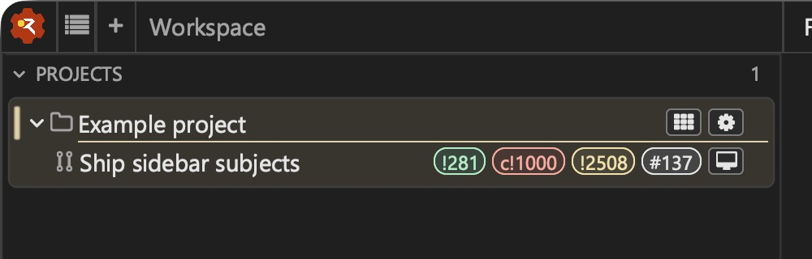
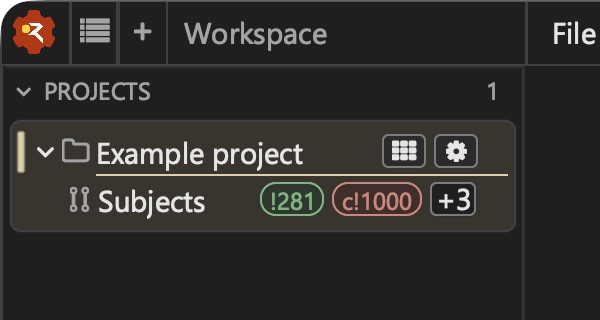
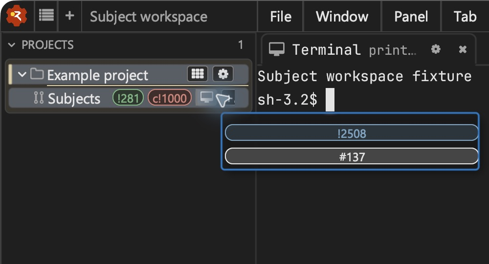

# Sidebar subject chips: acceptance

Convoy subjects are inline chips, in PR/issue numeric order. Workspace actions
share their area and one `+N` menu. Attention retains standalone PR rows, and
Issues, Show finished and Role attempts retain their existing visibility rules.

At width pressure, the name uses the producer's medium and short labels, then
elides to about ten characters. Unopened workspace actions fold before quiet issue/PR chips; within each class,
fold from the end of catalog order.
Ready-to-merge and CI-failing subjects, selected/pending workspaces and active
open workspaces remain visible. If those protected chips alone exceed the
available width, their area scrolls horizontally while the status slot stays
fixed. The last chip has two pixels of clearance for its border stroke.

Workspace actions use fixed-width icons. `presentation.icon` wins over a local
template `icon-override` field, then the entity kind supplies the default.
The prefixed `chip-*` fields are reserved inside the template’s marker-delimited
presentation block. A producer label starting with the same text stays a label.
Supported symbolic icons are `terminal`, `overview`, `role`, `threads`, `gear`,
`code`, `review` and `workspace`; other suggestions are literal glyphs. No name
is used to guess an icon. Open workspaces have a stronger fill and left edge,
selected workspaces have the selection fill, and pending actions show an
ellipsis without changing width. Every action retains its full label in the
hover card.
Retained ended workspaces keep the core's × marker and Ended workspace hover
text. That terminal state wins over pending or stale activity presentation.
Subject references and overflow labels retain their text beside the marker.

To assign a local role icon, select a template explicitly, for example a
`role/governor` template extending `role/native`, overriding `icon-override`
with `source="literal" value="gear" prefix="chip-icon-override:"`. Match that
role loop on `flotilla.role.name`, rather than changing the renderer. Producer
suggestions still win. The shipped template leaves the override empty.
Keep the inherited field order when extending a native template: the renderer
expects the presentation marker after one field for projects, four for roles
and three for other entries. Adding or removing earlier fields disables the
presentation block, so chips use their defaults. Typed ABI metadata will
eventually replace this convention.

## Kiwi human review

The operator reviewed the host-direct candidate with disposable profiles at
480-point and 260-point sidebar widths on 2026-10-04. The first review requested
clearance around the final governor chip's right border. After the two-pixel
correction, the operator accepted the presentation: “Looks ok”. The daily
driver was not restarted or replaced.







Reproduce with disposable settings:

```sh
./build/wheelhouse --sidebar_subject_fixture --user:/tmp/chips-user --project:/tmp/chips-project
```

- Hover a subject for its title, readiness, checks, review and observation times.
- Click a subject to open its canonical URL; right-click for Copy URL.
- The no-forge subject offers Copy reference and has no browser action.
- Open Subject workspace from `+N`: its active chip remains on the convoy row.
- Toggle Issues, Show finished and Role attempts to check existing placements.

The fixture forge uses `/review/` and `/ticket/` to expose hard-coded URL shapes.

## Verification

The macOS debug build uses the workflow-pinned dependency revisions and a
prepared Ghostty library. After rebasing onto #170, the 27 native ABI tests
pass against Andamento `b72a103`. They include the production width resolver's name
ladder, quiet fold order, protected workspace and extreme-width behavior.
The generated-fixture locale/newline test passes.

Native sidebar diagnostics check laid-out status geometry at 240, 320 and
600 pixels through latent, pending and removed-subject states. Both attention
subjects remain chips, and the existing workspace, selection, reveal, scrolling
and project-motion diagnostics pass. The width path also covers localized
wide-glyph names and compact references, including labels that resemble chip
directives. A retained-workspace scenario checks that terminal status wins
over stale template activity, including the pending marker and overflow label.
Icon resolution checks cover suggestion
precedence, a local template override and a default for a role with an arbitrary
label. The macOS PR chip Copy URL interaction also passed against the real
clipboard.

The X11 action test now reads actual fixture hit rectangles through
`--sidebar_subject_geometry:<path>` instead of clicking the retired child-row
positions. The optional geometry output is restricted to the embedded subject
fixture. Its browser subprocess records destinations without navigating, and
its clipboard reader checks chip and Attention copies. It passed against Xvfb
in a disposable Linux container on feta, including PR/issue destinations,
chip/Attention URL copies and the no-forge reference copy. The Linux build,
ABI/width tests and native sidebar diagnostics also passed. Cross-platform
CI results are recorded on the PR.

Unopened workspace actions enter `+N` before a quiet issue chip (owner ruling,
2026-10-05, #175). The action remains reachable from the project row and hover
card; the issue chip carries state only this row shows. Numeric PR/issue order
is retained. Attention-bearing chips never fold and the trailing status slot
never moves. For a narrow mixed row with an 80px name, 60px unopened action,
50px quiet issue and 30px overflow, a 160px content budget shows the issue and
`+1`; the unopened action goes into overflow even when it precedes the issue.
