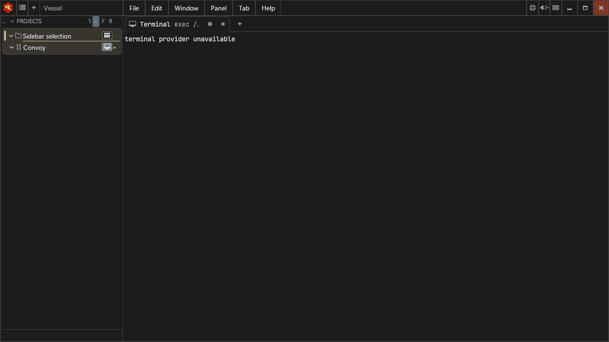
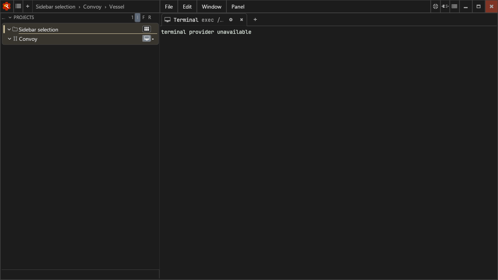
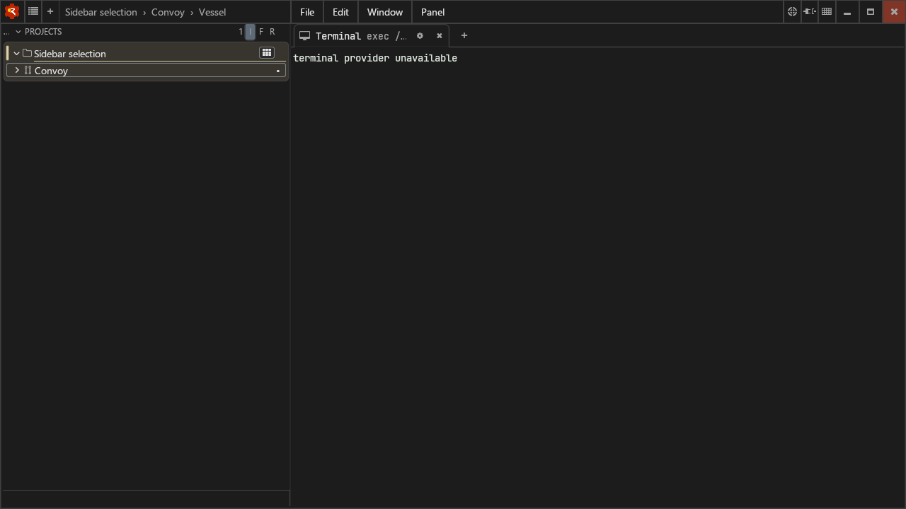
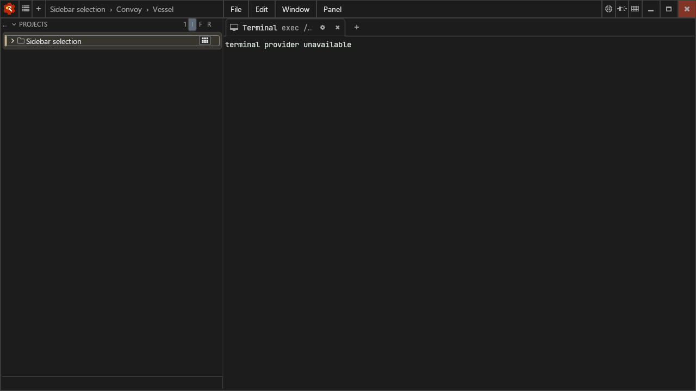

# Workspace selection and coverage

Selection belongs to the workspace subject. An action that targets the same
vessel can still focus it, but does not make its convoy another selected subject.
When convoy and vessel each have an open workspace, each keeps its own ID.

The native renderer chooses one subject appearance, preferring the deepest
placement and the first section on a tie. Visible rows and inline chips carry
selection. Expanded ancestors do not. Collapse hides descendant chips as well
as rows, and only the visible collapsed ancestor receives an outline. Section
headers follow the same rule. Outlines do not alter row geometry.

## Evidence

The native `--sidebar_diagnostics` scenarios exercise the real Andamento ABI,
font metrics, UI builder and emitted box colors/flags. They cover both current
subjects with both workspaces open, all project/convoy/section collapse states,
row and inline-chip layouts, aggregate and docked section rendering, and widths
of 240 and 800 pixels. Inventory coverage checks traverse collapsed descendants
and print `Open workspace without sidebar entry: <ID> (<name>)` for omissions.

The shipped-template ABI suite covers ended subjects with Show finished off,
producer removal, expired facts before observation, fresh-core restart without
subject facts, and unplaced kinds. Unobserved subjects use Other workspaces;
retained ended subjects stay in their original path with the ended marker until
closed. Role placement after daemon restart remains andamento#105.

Docked sections use the same selection resolver. Merging section Views into
one Panel does not introduce another highlight path: the selected View renders
its section through the same builder. An inactive View has no visible rows.
Detached hover cards retain their context but do not select sidebar ancestors.

These Linux/Xvfb captures use the daily-driver templates and real HTTP/UDS
publication, with a convoy action targeting the vessel. The sidebar widths are
256 and 410 pixels (the shell's normal width clamp); the isolated harness also
covers 240 and 800 pixels. Cleat uses its `none` test feature set, so the terminal
content is a placeholder. The evidence concerns sidebar selection, not VT output.









## Validation

- Andamento: 119 core unit tests and 44 sidebar scenarios pass. The revised
  sidebar suite fails against the original state implementation (seven failures).
- Wheelhouse: 31 shipped-template ABI scenarios pass. The native diagnostics
  pass with an 8 GiB address-space cap, one CPU adapter and one llvmpipe worker.
- Mutations removing exact subject binding and ended-path visibility each fail
  a core scenario. Native mutations dropping ancestor borders or outlining an
  expanded inline parent each fail the emitted-box selection scenario.

Run the native diagnostics with a display (Xvfb is sufficient):

```sh
WHEELHOUSE_CLEAT_FEATURES=none tools/run-sidebar-diagnostics.sh
```

The runner builds release mode because the debug arena table alone reserves
256 GiB. Like the sidebar benchmark runner, it bounds process-level CPU discovery
so cache stripe and worker reservations fit under `prlimit --as=8589934592 --`.


Companion core revision: `01889ff9baac5c9fc1c0d3c66719a6c0ba4ade23`
([andamento#131](https://github.com/flotilla-org/andamento/pull/131)). The governor
applies the matching `ANDAMENTO_REV` workflow pin; replace the temporary PR head
with the squash-merge revision after the companion merges.
